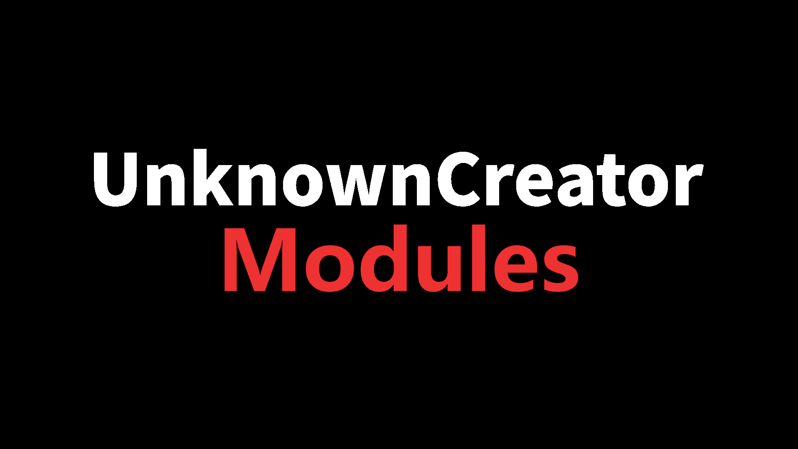

 

# UCM全称UnknownCreatorModules 自用框架

*拥有战斗模块编辑器和管理模块编辑器 
*各种工具方法扩展 
*默认使用了小米字体 

---------------------------------------------------

需要第三方插件 
[ 
Animancer 
]

---------------------------------------------------

*模块列表*
[
Debug模块 
管理器模块 
事件模块 
计时器模块 
场景模块 
UITK模块 
Json模块 
分层行为状态树模块 
运行时更新模块 
运行时变量储存模块 
对象池模块（C#分为引用池和Unity对象池） 
修改版LitJson 
修改版序列化字典 
修改版序列化引用 
相机模块 
单位控制器模块 
实体模块 
声音模块 
特效模块 
时间模块 
战斗模块（分为 单位，能力，buff，伤害，等级经验，统计，状态，天赋，投射物） 
]
